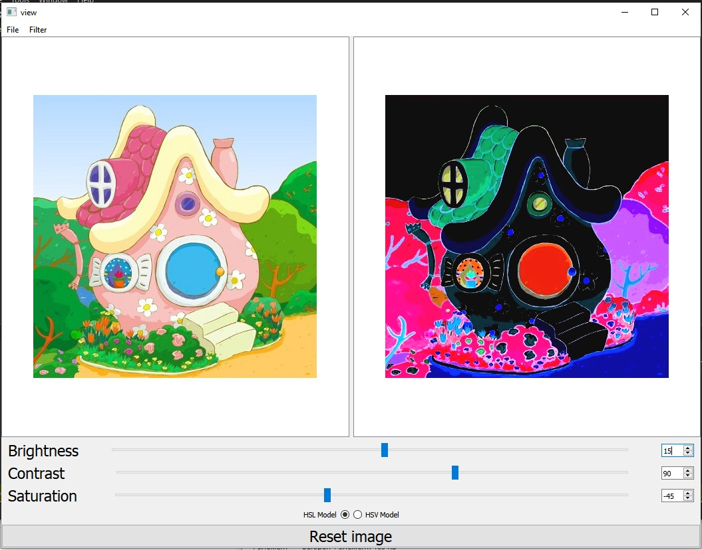

# Image-Processing
In this C++ application you can set following filters for .bmp image:
1. Brightness
2. Contrast
3. Saturation (in HSV and HSL format)
4. Discoloration
5. Negative
6. Toning
7. Emboss
8. Sharpen
9. Box blur
10. Gaussian blur
11. Laplacian filter
12. Sobel filter
13. Custom filter where you can fill matrix of Kernel filter

